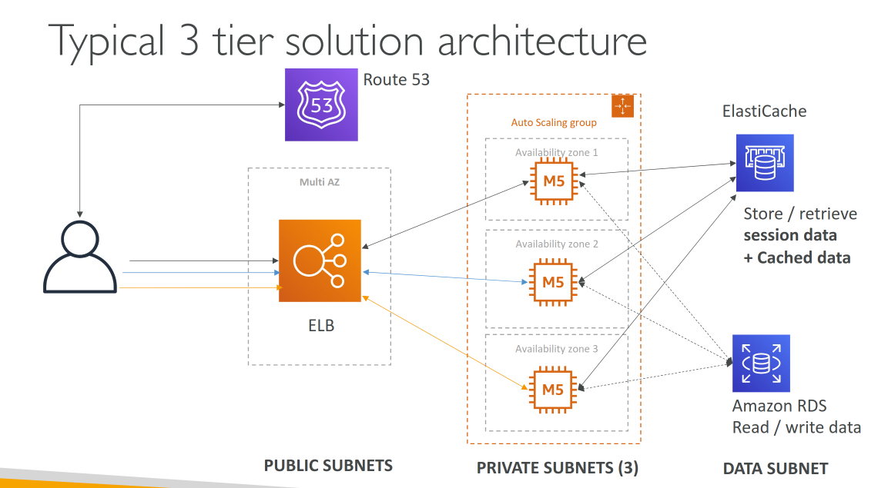

# Amazon VPC

## VPC Crash Course

- VPC is something to be known in depth for the AWS Certified Solutions Architect Associate & AWS Certified SysOps Administrator certificates
- At the AWS Certified Developer Level, you should know about:
  - VPC, Subnets, Internet Gateways & NAT Gateways
  - Security Groups, Network ACL (NACL), VPC Flow Logs
  - VPC Peering, VPC Endpoints
  - Site to Site VPN & Direct Connect
- Helpful VPC concepts will be highlighted later in the course

## VPC & Subnets Primer

- **VPC**: logically isolated virtual network in your account; you define IP range, subnets, gateways, security groups; resembles a traditional data center network [1]
- **Subnets**: range of IP addresses **in one Availability Zone**; resources (e.g. EC2) deploy into subnets [2]
- **Public subnet**: subnet whose associated route table has a **route to an internet gateway** [3]
- **Private subnet**: subnet whose route table **does not** have a route to an internet gateway (no internet path via IGW even if an instance had a public IP) [3]
- **Route Tables**: rules (**routes**) that send traffic from the subnet to a **destination** CIDR via a **target** (gateway, ENI, peering connection, etc.); explicit subnet association or implicit association with the **main** route table [2]

## Internet Gateway & NAT Gateways

**Internet gateway (IGW)** [3]

- Allows communication between VPC and the internet [3]
- Horizontally scaled, redundant, HA; IPv4 and IPv6; no extra bandwidth bottleneck from the IGW itself [3]
- Gives route table **target** for internet-routable traffic; public subnet instances need **public IPv4** or **IPv6** to talk to or be reached from the internet [3]
- IPv4: IGW performs **one-to-one NAT** between instance private address and public / Elastic IP [3]
- **No charge** for the IGW; data transfer charges still apply for EC2 using it [3]

**NAT gateway** [4]

- **Network Address Translation (NAT) service** [4]
- Instances in a private subnet can connect to services outside your VPC but external services can't initiate a connection with those instances [4]
- **Public** (default): private subnets reach **internet** via public NAT in a **public subnet**; needs **Elastic IP** at create; traffic to IGW for internet [4]
- **Private** NAT: reach other VPCs or on-premises via TGW/VGW; **no** EIP; IGW path drops if misrouted to internet [4]
- Connections must be **initiated from inside** the VPC that owns the NAT [4]

## Network ACL & Security Groups

### Network ACL

- **Network access control list (network ACL)**: allows or denies **specific inbound or outbound traffic at the subnet level** [5]
- Optional **custom** NACL with rules in addition to the **default** NACL; can mirror SG-style rules for extra layer of security [5]
- **No additional charge** for network ACLs [5]

### Security group

- **Security group**: controls traffic **allowed to reach and leave** the resources it is associated with (inbound and outbound rules: source/destination, port, protocol) [6]
- Acts as a **virtual firewall** for associated resources (e.g. EC2); each VPC gets a **default** security group; you can add more [6]
- **No additional charge** for security groups [6]

### Network ACLs vs Security Groups

Summary table aligns with AWS comparison [7]:

| Characteristic | Security group | Network ACL |
| -------------- | ---------------- | ----------- |
| Level | ENI / instance | Subnet |
| Scope | Instances in the SG | All instances in associated subnets |
| Rules | **Allow** only | **Allow** and **deny** |
| Evaluation | All rules evaluated before decision | **Ascending** rule number until first match |
| Return traffic | Stateful (allowed return) | Stateless (must allow explicitly) |

- SG: primary control; NACL: optional **defense in depth**, coarse subnet rules, deny subsets [7]
- NACL: **stateless**; evaluated on **enter and leave** subnet [5]
- Neither SG nor NACL filter AWS DNS, DHCP, IMDS, Time Sync, default router reserved IPs [5][6]

## VPC Flow Logs

- Captures metadata about IP traffic **to and from** ENIs in the VPC [8]
- Publish to **CloudWatch Logs**, **S3**, or **Data Firehose** (subscriptions) [8]
- Use cases: diagnose tight SG rules, monitor traffic reaching instances, see traffic direction [8]
- Collected **off** the data path; no throughput/latency impact [8]
- Ingestion/archival costs apply for published logs [8]

## VPC Peering

- Connection between **two** VPCs [9]
- Traffic uses **private IPv4 or IPv6** [9]
- Same or different account [9]
- **Inter-Region** supported [9]
- Not a gateway or VPN; uses VPC infrastructure [9]
- **No single point of failure** or bandwidth bottleneck called out for the peering construct [9]
- Peered VPCs need **non-overlapping** CIDRs in supported configurations; routing uses **pcx-** target in route tables [10]
- **Not transitive**: if A peers with B and A peers with C, **B and C cannot** reach each other **through** A; need direct peering or other design [10]

## VPC Endpoints

- Private connectivity from VPC to services and resources, as if they were in the VPC, instead of connection through the public network [13]
- **AWS PrivateLink**: connect VPC to services as if inside the VPC; **no** IGW, NAT, public IP, Direct Connect, or Site-to-Site VPN required for that private access path [13]
- **VPC endpoints** (interface, gateway, etc.) attach clients to PrivateLink-backed services [13]

## Site to Site VPN & Direct Connect

**Site-to-Site VPN** [11]

- Connect an on-premises VPN to AWS
- The connection is automatically encrypted
- Goes over the public internet

**Direct Connect** [12]

- Dedicated **Ethernet** link from your network to a **Direct Connect location** [12]
- **Virtual interfaces** to public AWS services or **VPC** (private IPs); bypasses ISPs on that path [12]
- **PrivateLink** documentation contrasts VPC endpoints with connectivity that may use Direct Connect or VPN for other paths [13]

## VPC Closing Comments

- **VPC**: Virtual Private Cloud, isolated virtual network [1]
- **Subnets**: tied to one **AZ**, partition of the VPC CIDR [2]
- **Internet Gateway**: VPC-scoped path to internet for public subnets and NAT upstream [3]
- **NAT Gateway / Instances**: outbound-only path from private subnets to internet (public NAT) [4]
- **NACL**: Stateless, subnet-level allow/deny [5]
- **Security Groups**: Stateful, associated with ENI / instance [6]
- **VPC Peering**: pairwise; non-overlapping CIDRs; **not transitive** [10]
- **VPC Endpoints / PrivateLink**: private access to AWS and partner services without internet path [13]
- **VPC Flow Logs**: IP traffic metadata to S3 / CWL / Firehose [8]
- **Site-to-Site VPN**: IPsec from on-premises to VGW/TGW [11]
- **Direct Connect**: private Layer 2 connection to AWS [12]

## Examples 

### Typical 3 tier solution architecture

**Three tiers** (presentation, application, data): use **subnets to isolate tiers** in one VPC; use **private subnets** for tiers that must not be reached directly from the internet [7]

**Typical layout**

1. **Web / presentation tier**
    - Often **public subnets** for internet-facing load balancers (ALB/NLB) and sometimes web EC2; clients hit the LB [14]
2. **Application tier**
    - **Private subnets** for app or API servers; inbound only from web tier (SG); **outbound** via **NAT gateway** in a public subnet if internet or SaaS access is needed [4][7]
3. **Data tier**
    - **Private subnets** for RDS / self-managed DB; inbound only from application (or web, if no separate app tier) security groups; **no** direct internet path [7][14]

**Security groups (conceptual)**

- **LB SG**: allow client traffic on listener ports from the internet or your CIDR [14]
- **Web / app SG**: allow app protocol from LB SG; allow app-to-DB ports only toward DB SG [14]
- **DB SG**: allow DB port only from app (or web) SG [14]

**Resiliency**

- Spread subnets across **multiple Availability Zones** so each tier can run in more than one AZ [14]

### LAMP Stack on EC2

- Linux: OS for EC2 instances
- Apache: Web Server that run on Linux (EC2)
- MySQL: database on RDS
- PHP: Application logic (running on EC2)
- Can add Redis / Memcached (ElastiCache) to include a caching tech
- To store local application data & software: EBS drive (root)

## References

- [What is Amazon VPC?][1]
- [How Amazon VPC works][2]
- [Enable internet access for a VPC using an internet gateway][3]
- [NAT gateways][4]
- [Control subnet traffic with network access control lists][5]
- [Control traffic to your AWS resources using security groups][6]
- [Infrastructure security in Amazon VPC][7]
- [Logging IP traffic using VPC Flow Logs][8]
- [What is VPC peering?][9]
- [VPC peering configurations with routes to an entire VPC][10]
- [Connect your VPC to remote networks using AWS Virtual Private Network][11]
- [What is Direct Connect?][12]
- [What is AWS PrivateLink?][13]
- [Example: VPC for web and database servers][14]

[1]: https://docs.aws.amazon.com/vpc/latest/userguide/what-is-amazon-vpc.html
[2]: https://docs.aws.amazon.com/vpc/latest/userguide/VPC_Subnets.html
[3]: https://docs.aws.amazon.com/vpc/latest/userguide/VPC_Internet_Gateway.html
[4]: https://docs.aws.amazon.com/vpc/latest/userguide/vpc-nat-gateway.html
[5]: https://docs.aws.amazon.com/vpc/latest/userguide/vpc-network-acls.html
[6]: https://docs.aws.amazon.com/vpc/latest/userguide/VPC_SecurityGroups.html
[7]: https://docs.aws.amazon.com/vpc/latest/userguide/infrastructure-security.html
[8]: https://docs.aws.amazon.com/vpc/latest/userguide/flow-logs.html
[9]: https://docs.aws.amazon.com/vpc/latest/peering/what-is-vpc-peering.html
[10]: https://docs.aws.amazon.com/vpc/latest/peering/peering-configurations-full-access.html
[11]: https://docs.aws.amazon.com/vpc/latest/userguide/vpn-connections.html
[12]: https://docs.aws.amazon.com/directconnect/latest/UserGuide/Welcome.html
[13]: https://docs.aws.amazon.com/vpc/latest/privatelink/what-is-privatelink.html
[14]: https://docs.aws.amazon.com/vpc/latest/userguide/vpc-example-web-database-servers.html

